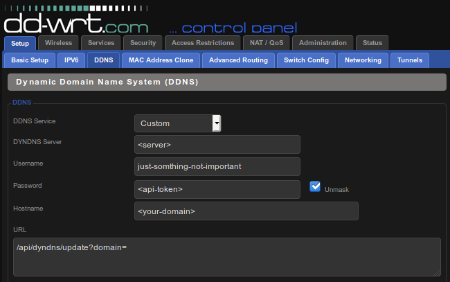

# 1&1 DynDNS Updater
1&1 IONOS does support Dynamic DNS but does not provide an API where the router could update it's ip address automatically. They recommend you run a python tool `domain-connect-dyndns` every minute to keep your domain updated.

The 1&1 DynDNS Updater is like a DynDNS provider for 1&1. It's add the missing support to update your ip address over the router.

Related 1&1 articles:
- [What is a DDNS (dynamic DNS)?](https://www.ionos.com/digitalguide/server/know-how/what-is-a-ddns-dynamic-dns/)
- [Free dynamic DNS providers: An overview](https://www.ionos.com/digitalguide/server/tools/free-dynamic-dns-providers-an-overview/)
- [Connecting a Domain to a Network with a Changing IP using Dynamic DNS (Linux)](https://www.ionos.com/help/domains/configuring-your-ip-address/connecting-a-domain-to-a-network-with-a-changing-ip-using-dynamic-dns-linux/)
- [Connecting a Domain to a Network with a Changing IP using Dynamic DNS (Windows)](https://www.ionos.com/help/domains/configuring-your-ip-address/connecting-a-domain-to-a-network-with-a-changing-ip-using-dynamic-dns-windows/)


## Installation
```bash
# get sources
git clone https://github.com/HeinrichAD/DomainConnectDDNS-Python.git
cd DomainConnectDDNS-Python

# copy .env example and MODIFY it!
cp .env.example .env
php artisan key:generate --ansi
php artisan code:set <UNDER_CONSTRUCTION_CODE>

# install and build
composer install
# first composer install include also:
#composer run-script npm-install
#composer run-script docker-volume-update
#composer run-script docker-build

#php artisan serve [--host=<host>] [--port=<port>]
docker-compose up -d
```


## About the source
Only neseccery is the little class [`Connect`](/app/DynDNS/Connect.php).
Everything else is to add a small web interface or to add docker support.


## Requirements
> The requirements are covered with the dockerized version.

A extended version of the python tool `domain-connect-dyndns` is required.
The tool this avalible here: [HeinrichAD/DomainConnectDDNS-Python](https://github.com/HeinrichAD/DomainConnectDDNS-Python). It's a forced and slightly modified version of [Domain-Connect/DomainConnectDDNS-Python](https://github.com/Domain-Connect/DomainConnectDDNS-Python).


## OpenWrt and DD-WRT setup


| Key | Value |
|--|--|
| DDNS Service | Custom |
| DYNDNS Server | Ip or dns name where the DynDNS Updater is avalible. |
| Username | Not important. Just something to avoid warnings. |
| Password | API Token |
| Hostname | Your domain (e.g.: example.com) |
| URL | fix to: `/api/dyndns/update?domain=` |
